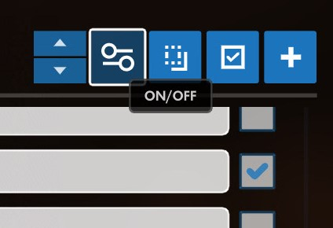
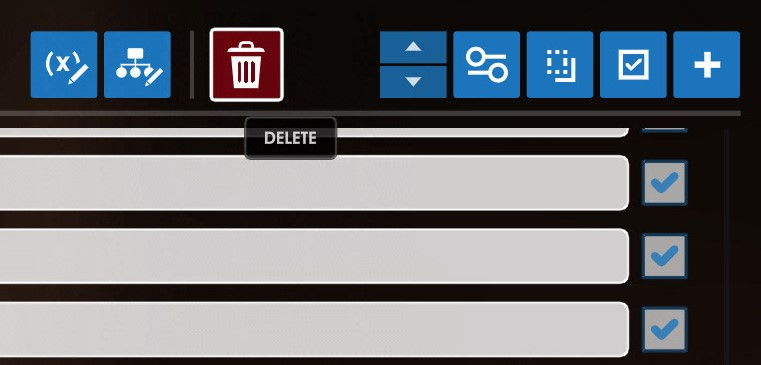

# Nebula's Force Orb Order Mod for Hax Framework

## **WARNING:** 
This is a modification to the KNEAT template made by Hax. BEFORE PASTING ANY CODE, MAKE SURE YOU ARE NOT OVERWRITING ANY EXISTING VARIABLES or SUBROUTINES. 
Variables and subroutines in the workshop are numbered, check that the NEW variables and subroutines defined in this mod are free in your live map (ie. make sure its number is a free slot in the variable list (non-free variables are greyed out); if not, change its number to a number with a free slot).

Additionally, this is not to be used with any other orbs than **ability** orbs. Death orbs will **NOT** work. I have not tested any other orb but I assume they will all be broken on any checkpoint that uses this mod!  

## REFERENCE FOR NEW VARIABLES/SUBROUTINES:
```
variables
{
	global:
		119: OrbColorArrayNebula
		120: OrbColorNebula
		121: exitButtonProperties
		122: textBudget
		123: _arrayBuilder
		124: _extendedGlobalCollection
		125: CParrayCreated
		126: CParray3orb
		127: CParray2orb	

	player:
		114: OrbButton3
		115: OrbButton2
		116: CParrayPopulateButton
		117: _extendedPlayerCollection
		118: getProperties
		119: buttonModification
		120: currActionID
		121: destroyButtonID
		122: lastMenuButtonID
		123: buttons
		124: newButton
		125: menuOriginalFacing
		126: menuFrame
		127: isInMenu
}

subroutines
{
	118: createMenuButton
	119: destroyMenuButton
	120: modifyMenuButton
	121: getButtonProperties
	122: createCursor
	123: createBorderCorners
	124: createBorderEdges
	125: createExitButton
	126: doButtonUpdate
	127: createClickAreas
}
```

I recommend using Notepad++ as your text editor!

# INSTALLATION

## STEP ONE: 
**ATTENTION: Save your map data!!! Preferably in a .txt file!!!**  
IN THE HAVVX TEMPLATE:  
1. Copy and paste the code from the *HAVVX_Orb_Numbers.txt* file and reload.  
This allows you to see clearly the order of the orbs while creating a checkpoint.  
I suggest placing all orbs you will need *BEFORE* fine-tuning their size/position because the numbering changes during orb creation.  
Otherwise, you may have to reposition the orbs!  

**ATTENTION: Save your map data!!! Preferably in a .txt file!!!**  

## STEP TWO:
IN THE KNEAT TEMPLATE:
1. Copy and paste the contents of *Checkpoint_Marking_System.txt* into your live map and reload.  

2. Press *Melee* to open (and close) the menu.  
3. Click *Populate* in the menu; this will initialize the marking arrays and the button will disappear.  
Two new buttons (*Mark 2 Orb* and *Mark 3 Orb*) will appear.  
4. Navigate to the checkpoints that require this mod and click the corresponding button.  
A small message will appear on screen showing that the checkpoint has been set to *True*.  
If you accidentally mark a checkpoint, press the same button again and a message will appear on screen saying the checkpoint has been set to *False*.  
You are unable to set a single checkpoint to both 3 Orb and 2 Orb. It will default to the last selection.  

## STEP THREE: 
1. Press *Esc* and then click the *Open Workshop Inspector* button.  
2. Select *Global* from the drop down menu in the bottom right corner of the Inspector.  

3. Click the "(x)" button directly to the left of the drop-down menu which will copy to clipboard all global variables as workshop actions.  

4. In the Workshop Editor, create a new temporary rule by pressing the blue "+" in the top right corner of the Workshop Editor. 

5. Paste what you copied from the Inspector into the *actions* section of the rule you just created. 
The only actions you will need in this list are the last two.   
They define the variables *CParray2orb* and *CParray3orb*.  


## STEP FOUR:  
1. Disable the Hax Framework rule named *TCD detect*.   

2. Disable or delete the 24 rules that were pasted in step two.  
**WARNING: AFTER CLICKING DELETE, ENSURE THE MESSAGE SAYS 24 RULES. YOU MAY ACCIDENTALLY DELETE NECESSARY RULES.**



## STEP FIVE:  
1. Copy and paste the contents of *Nebulas_Mod.txt* into your live map.  
2. Return to the temporary rule created in step three.
3. Copy both arrays (*CParray2orb* and *CParray3orb*).

4. Paste into the *actions* section of the *Global CParray Initialize | Nebula's Mod* rule  

5. Delete the temporary rule created in step three.  
6. Reload.

## CUSTOMIZATION:
- There is a drop-down menu in Workshop Settings that will change the color of the numbers above the orbs.


